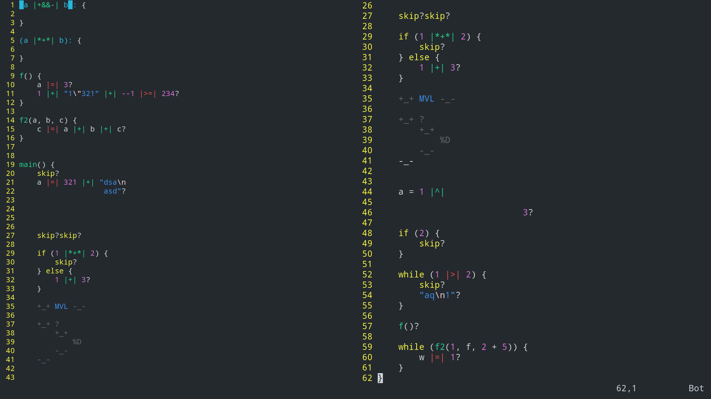

# MVL
### a.k.a Most Valuable Language

## Syntax

##### Functions defenitions

```
f_name(arg1, arg2) {
    skip?
}
```

##### Loops

```
while [expr] {
    skip?
}
```

##### Operators

base operators: |[ `+, -, *, /, ^, !, <, >, =, [<>=/]=`]|
operator = `|(base operators)+|`

##### If

```
if [expr] {
    skip?
} endif
```

```
if [expr] {
    skip?
} else {
    skip?
} endif
```

##### Operators overloading

```
|new operator|: {
    skip?
}
```

##### Comments
###### multistring
open: `+_+`, close - `-_-`  
example:
```
+_+ comment here 
  +_+ and here -_- 
still here -_-
```
###### singlestring
syntax: `O_o`
example:
```
O_o comment here O_o and here
not comment
```

## Vim support



#### Install

`cd vim_support`  

Add `vimrc` file contents into your `~/.vimrc` file.  

```
mkdir -p ~/.vim/syntax/
cp mvl.vim ~/.vim/syntax/
cp mvl_keywords.txt ~/.vim/

```

Now you can see highlighting and use autocomplete, by pressing `Ctrl+n`, inside our `*.mvl` files.  
There is also automatic addition of brackets, and macroses `@m` for `main` function and `@f` for other functions.  
Comment lines: select lines in visual mode (or nothing for one line) and type `,cc` for comment and `,cu` for uncomment lines.
