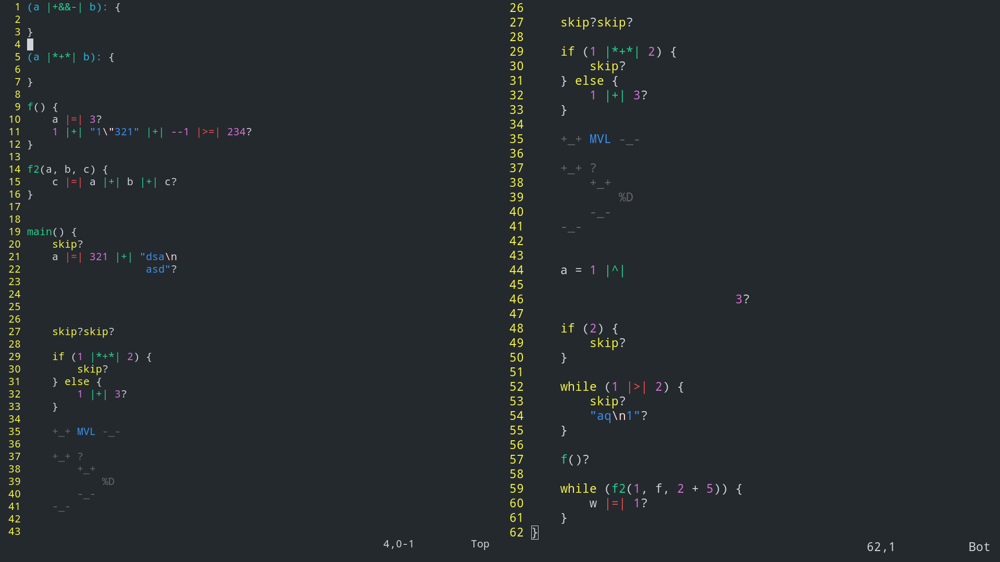

# MVL
### a.k.a Most Valuable Language

TODO: description

## Vim support



#### Install

`cd vim_support`  

Add `vimrc` file contents into your `~/.vimrc` file.  

```
mkdir -p ~/.vim/syntax/
cp mvl.vim ~/.vim/syntax/
cp mvl_keywords.txt ~/.vim/

```

Now you can see highlighting and use autocomplete, by pressing `Ctrl+n`, inside our `*.mvl` files.  
There is also automatic addition of brackets, and macroses `@m` for `main` function and `@f` for other functions.
